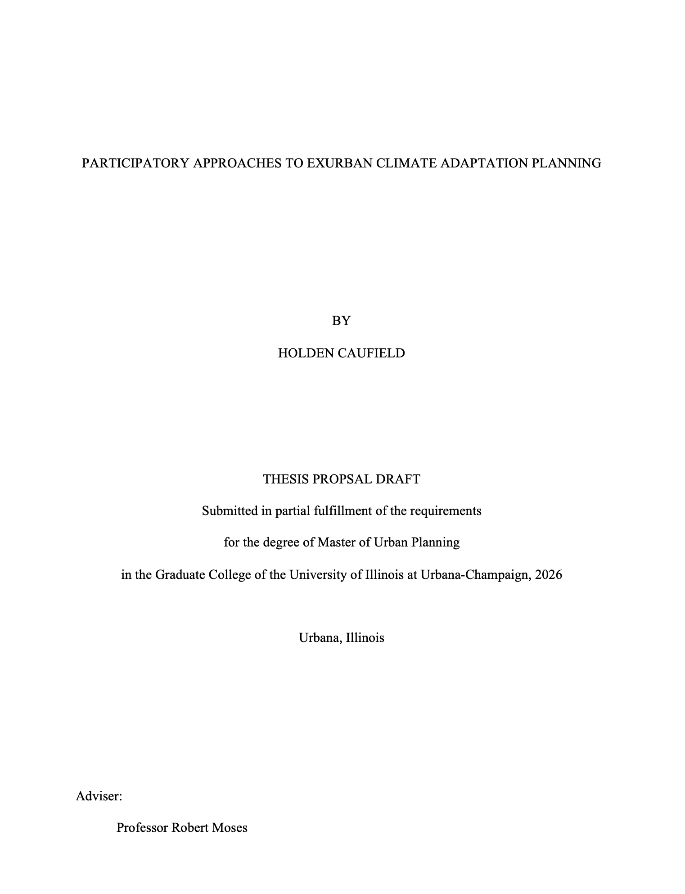

# The MUP Thesis Pathway

## Pathway Description

The MUP thesis pathway offers students with the opportunity to gain substantive experience working independently as a researcher conducting original work that contributes to the field of urban planning. The thesis pathway allows MUP students  to independently develop specialized knowledge through the design and implementation of original research. 

The MUP Thesis is a scholarly applied or basic research work conducted under the formal Thesis Guidelines of the Department and Graduate College. The audience for a master’s thesis is typically academic and applied researchers. The thesis option is most appropriate for MUP students with a strong interest in pursuing a research-oriented career or PhD degree.

Because the MUP thesis must follow both department guidelines and university thesis guidelines, we provide a more detailed guide for thesis timing, development, execution.

## Expected Outputs

The MUP thesis requires two specific outputs - a MUP thesis manuscript formatted following Graduate College [thesis format requirements](https://grad.illinois.edu/academics/thesis-dissertation/format-requirements) and a formal public thesis defense at which the student's thesis committee provides feedback and determines whether the thesis is of sufficient substance and quality to be approved.

## Adopting This Pathway

In the spring of your MUP 1 year, you will be asked to declare your capstone pathway (workshop, project, or thesis). At this point, your choice is not binding. You will also recieve detailed descriptions of the four UP 510: Plan Making Workshop sections being offered during your second year. You will select a proposed pathway, and then indicate your rank order preference for all four of the UP 510: Plan Making Workshop sections.

After all MUP 1 students have declared a preliminary capstone pathway, students declaring the thesis pathway will be assigned to one UP 510: Plan Making Workshop section for the second year and will be authorized to register only for that assigned workshop section. 

## Resources

The Graduate College's [thesis website](https://grad.illinois.edu/academics/thesis-dissertation) provides details and resources to assist in the thesis development and completion process.

The Department's MUP Handbook provides specific departmental guidelines on the thesis pathway.

Completed MUP theses are archived in the university's [IDEALS repository](https://www.ideals.illinois.edu/collections/203). Any student considering pursuing the thesis pathway should start by looking at completed theses for inspiration and to understand thesis conventions in our department.

## Thesis Process Guidelines

### Thesis Proposal Development

The starting place for a MUP thesis is proposal development. A typical thesis proposal is 10-15 pages long (excluding references). A typical thesis proposal does the following:

1.  Outlines the specific research questions being examined in the thesis.

2.  Provides a detailed rationale rooted in existing literature for exploring these research questions and their context.

3.  Defines the stakes or reasons why answering the research questions are important for planning scholarship and practice.

4.  Outlines in detail the methodology and analysis which will be utilized within the thesis research.

5.  Outlines the thesis timeline and key outputs.

At a minimum, a MUP thesis proposal consists of the following components:

1. Title Page
2. Abstract
3. Research Context and Rationale
4. Research Questions
5. Methods
6. Expected Outcomes
7. Timeline
8. Works Cited

#### Title Page

**Length:** 1 Page

Include a title page following [Graduate College formatting requirements](https://grad.illinois.edu/document/student-success/thesis-masters-titlepage-example).

For your thesis proposal title page, be sure to indicate that this is the purpose of the document (see the example below):

As you develop your thesis title, keep in mind that this is one of the first ways in which people may find your work and chose to read it. Your thesis title should be concise, typically no more than 20 words, and should succinctly convey the thesis subject and purpose. Depending upon your approach, you may also mention methods, outcomes, or applications.

#### Abstract

**Length:** 400 Words

Provide an abstract that summarizes the proposed thesis. Your abstract should be around 400 words, should be clear, concise, and should convey your thesis subject, key questions, methods, and contribution of the work.
#### Research Context and Rationale

**Length:** Around 1,200 Words

Provide context and a rationale for your research, drawing heavily from related literature. Review the state of knowledge surrounding the issue your thesis will address, again, providing citations back to the relevant academic literature. Use this literature to help us see the rationale for your specific thesis research and to understand what gaps in knowledge your research will help to address.

#### Research Questions

**Length:** Around 200 Words

Describe your specific research question(s) which your thesis will address. Research questions should be written in plain language, should be clear, and should be well connected and justified by your research context and rationale.

#### Methods

**Length:** Around 1,200 Words

Provide a narrative description of the methods you will use to examine and answer your research questions. Depending upon your proposed methodology, it may be useful to break your description of methods into phases or activities. If appropriate define and describe primary or secondary data sources. Primary data collection strategies must be described. Analytical approaches to data should be described.

In addition to describing your approach, your methods section should also make reference to similar approaches others have taken. You will likely refer here to some of the literature you have previously cited in your research context and rationale section.

#### Expected Outcomes

**Length:** Around 500 Words

Describe the anticipated outcomes and impacts of your research. What will we learn from your research? How will your approach to the research questions contribute to a broader understanding in teh field? How might researchers and practitioners make use of the findings from your work?

This is also a good place to describe the prospective audience for your research.

#### Timeline

**Length:** Around 400 Words excluding Gantt Chart

Provide a timeline of activities from May of your first year to May of your graduating year (typically your second year). Use a Gantt chart to visualize the timeline of activities and also include narrative descriptions of key activities. Include information about how you will use time during the summer and winter breaks, noting any periods used for field work and data collection. Consider and include department and Graduate College deadlines for defending and depositing your thesis in advance of your graduation.

Consider the following key dates which should at a minumum be accounted for in your timeline:

1. Fall Break
2. Winter Break
3. Draft Thesis to Committee: At least two weeks before your proposed thesis defense
4. Draft Poster Review
5. Department Approval: This is your thesis defense. Schedule this for a minimum of 2 weeks prior to the 6. Graduate College Deposit Deadline
7. Graduate College Approval: Minimum of 1 week prior to the Graduate College Deposit Deadline
8. Department Poster Reception

#### References

**Length:** No Maximum

Bibliographic references for all literature cited throughout your proposal should be included in your references section using [APA cication format](https://apastyle.apa.org/style-grammar-guidelines/references/examples#textual-works).Likewise, you should include author-date parenthetical citations following APA style throughout your proposal. Using reference management software from the onset of your thesis is highly recommended.

### Proposal Timeline and Approval

#### Initial Proposal Draft

You should start working on an initial draft of your thesis proposal in the spring of your first year. We recommend having a complete draft of your thesis proposal by spring break of your first year. You will share this early draft with a prospective faculty thesis advisor at this time to both seek feedback and assess their willingness to serve as your thesis faculty advisor. While you do not need to have your thesis proposal finalized by the end of your second semester, you need to have shared a draft proposal with a departmental faculty member whose scholarly expertise aligns with your thesis research, and need to have secured their commitment in principle to advise you on the thesis. During the capstone adoption process in April of your first year, if you are pursuing the thesis pathway, you will be asked to share the subject of your thesis as well as the name of the faculty member who has committed to advise you.

#### Proposal Review and Approval

Faculty engagement and guidance is integral to the successful completion of the MUP thesis. Each thesis is guided by a committee of at least two faculty members selected by the MUP student. One of these two faculty members will serve as chair of the thesis committee and will have primary responsibility for providing guidance and accountability throughout the thesis process.

Thesis committee members should be selected and should engage with your thesis proposal prior to formal capstone adoption at the beginning of the fall semester of your second year. As part of the capstone adoption process, in the spring of your first year, your thesis faculty advisor and committee member should review your proposal and should agree in principle to work with you on the continued development of the thesis framework.

Over the summer in between your first and second years, you will refine your written thesis proposal in anticipation of securing formal approval for your thesis proposal from your thesis committee by the beginning of the fall semester of your second year (the 10th day of classes). 

Your thesis committee members must sign off on the department capstone adoption form which certifies that they have reviewed and approved of your thesis proposal. After committee approval, the Director of Graduate Studies must also approve of your thesis in order to officially adopt the thesis capstone pathway.

Both your thesis faculty committee and the Director of Graduate Studies must review and approve of your thesis in order for you to adopt the thesis capstone pathway. Either your committee or the Director of Graduate Studies may request revision to your proposal if components are underdeveloped or lack sufficient clarity. Your thesis proposal must be approved by both your committee and the Director of Graduate Studies by the conclusion of the capstone adoption period (the registrar's 10th day of classes deadline in the fall semester of your second year). If you have not successfully completed adoption of the thesis pathway by this time, you will be asked to switch to a different capstone pathway.

### Initiating Approved Research

After your thesis proposal is approved and you have formally adopted the thesis pathway, you may continue with your research as informed by your approved proposed timeline. There are two early process steps that can often make or break successful adherance to a thesis timeline:

- **IRB Approval:** Most research involving human subjects requires the submission and approval of an [IRB Protocol](https://oprs.research.illinois.edu/submissions/submitting-irb) before data collection with human subjects can begin. IRB applications require a lot of details and may require several rounds of review and revision on the part of the IRB. Students may fill out an IRB application but the application must be submitted by a faculty member, typically your committee chair, serving in the role of Principal Investigator for your research protocol.

Budget at 4-6 weeks from your initial submission for the review and approval of human subjects research by the IRB.

**Data Acquisition:** Both primary data and secondary data can take time to collect or acquire. It is important to initiate data collection or acquisition early in the thesis process. Student researchers often underestimate the time it will take to acquire, clean, and prepare both primary and secondary data for use in research. Thesis committee members should provide detailed feedback on the feasibility of data collection and cleaning as part of the initial conversation around the thesis proposal.

### Thesis Review, Defense, and Deposit

Once you have completed your thesis research and prepared your thesis manuscript formatted following [Graduate College guidelines](https://grad.illinois.edu/academics/thesis-dissertation/format-requirements), you will submit it for review and approval by your thesis committee.

Review and defense certifies the completion of the thesis and deposit records its completion and archiving with the university.

#### Thesis Review

Thesis review and defense typically happens in the fourth semester of the MUP program. Working backwards from the Graduate College's Master's thesis deposit deadline, the thesis student should budget sufficient time for their committee to review the complete draft thesis manuscript before the thesis defense, as well as sufficient time after the defense to make revisions prior to the format review and deposit of the thesis with the Graduate College. The Department recommends budgeting *a minimum* of 5 weeks for thesis review and deposit:

- Committee Review of Complete Thesis Draft (minimum 2 weeks before thesis defense)
- Thesis Defense (minimum 2 weeks before deposit)
- Thesis Format Review and Deposit (minimum 1 week before Graduate College deposit deadline)

#### Thesis Defense

The Department requires the public defense of all MUP theses. The defense typically consists of a presentation open to the community at large that summarizes your thesis research. While the presentation format will be determined by your thesis committee, it is typically between 20-30 minutes followed by an additional 20-30 minutes of time for questions from the public and your committee members.

After the conclusion of the presentation and public Q and A time, your committee may also call for a closed Q and A time to discuss your completed thesis manuscript and provide you with feedback in more detail. At the conclusion of this closed time, your committee members will typically ask you to leave the room so they can discuss any additional feedback and determine whether you have successfully passed your thesis defense. The result of your defense is either that you pass, pass with qualifications, or fail the thesis defense.

- **Pass:** Passing the defense means that you have successfully gained approval for your thesis. Your committee may still request minor revisions or give your advice on additional alterations to make prior to depositing your final thesis manuscript. In most cases, a thesis committee will indicate that a pass means that the thesis requires no further review on the part of committee members.

- **Pass With Qualifications**: Passing the defense with qualifications means that you have successfully gained approval for your thesis but this approval is contingent upon some qualifications - typically some revisions to your analysis or writing. Passing with qualifications may require further review from the thesis committee or your thesis advisor prior to them providing final approval for your thesis. If your committee agrees that you pass with qualifications, they will typically provide you with detailed feedback on required revisions before the conclusion of your thesis defense.

- **Fail:** Failing the defense means that your committee agrees that some aspect(s) of your thesis do not meet standards or require substantial revision to be acceptable. A failing exam will typically require the scheduling of a new defense in the future after substantial revisions have been made to the thesis research. 

At the conclusion of the thesis defense, your committee will complete a deposit signature page that indicates the results of your exam. This cover page must be submitted along with your complete thesis manuscript for deposit.

#### Thesis Deposit

The Graduate College provides detailed tutorials on the thesis deposit process [available here](https://grad.illinois.edu/academics/thesis-dissertation/submit-your-thesis).

## Committee Expectations

1. MUP Thesis committee members will read and provide feedback on the thesis proposal prior to formal adoption of the thesis project.

2. The Thesis Committee Chair will play an active role in guiding the development and execution of the thesis project. In order to do they, the Committee Chair should a) have expertise and familiarity with the thesis topic and methods; b) be willing to commit to work with the student closely throughout the thesis development and execution process; and, c) be willing to coordinate with the other committee member and department administration to support the successful execution and completion of the MUP student's thesis project.

3. The Thesis Committee Chair should plan to meet regularly with the thesis student while they are registered for thesis credit hours.

4. The Thesis Committee Member(s) should play an active role in guiding the development and execution of the thesis, including periodic meetings on the thesis project and regular updates / accountability around the thesis project.

5. The thesis student is expected to provide updates on their progress to their committee members at least once per month. At least one full meeting of the thesis committee is expected each semester after the committee is formed.

6. It is the responsibility of the thesis student to be aware of and accountable for all deadlines and timing associated with thesis adoption, preparation, and deposit. 

7. Any concerns from committee members on the productivity or progress of the thesis student should be communicated to the thesis committee chair and the Director of Graduate Studies to provide additional support for students in the thesis execution process.